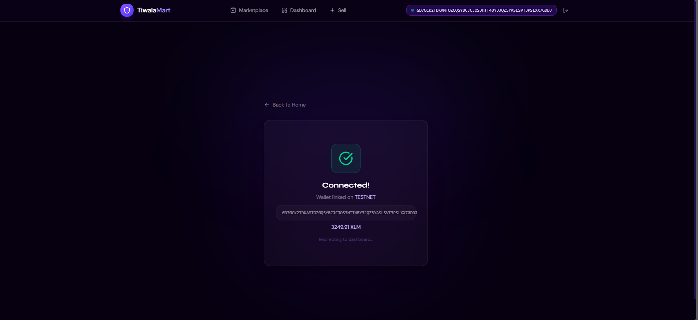
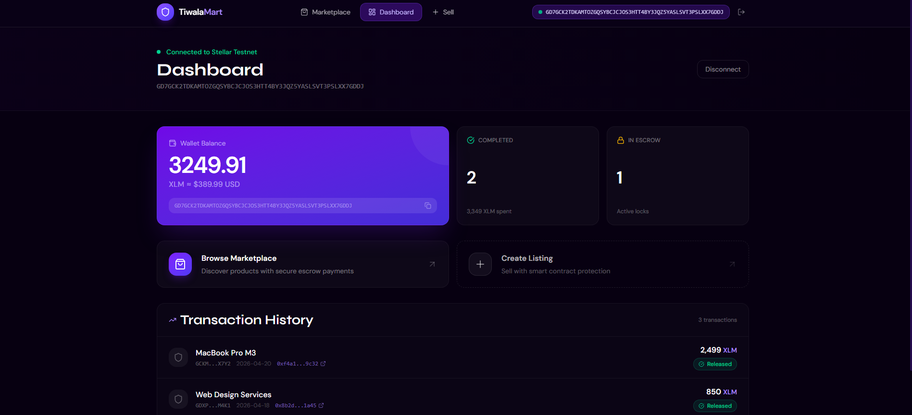
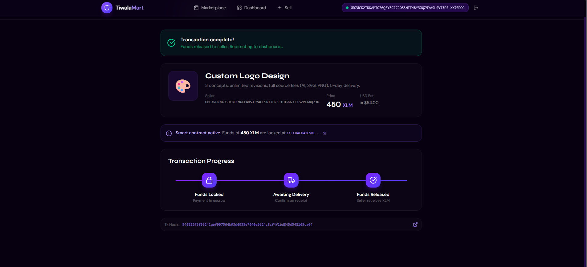
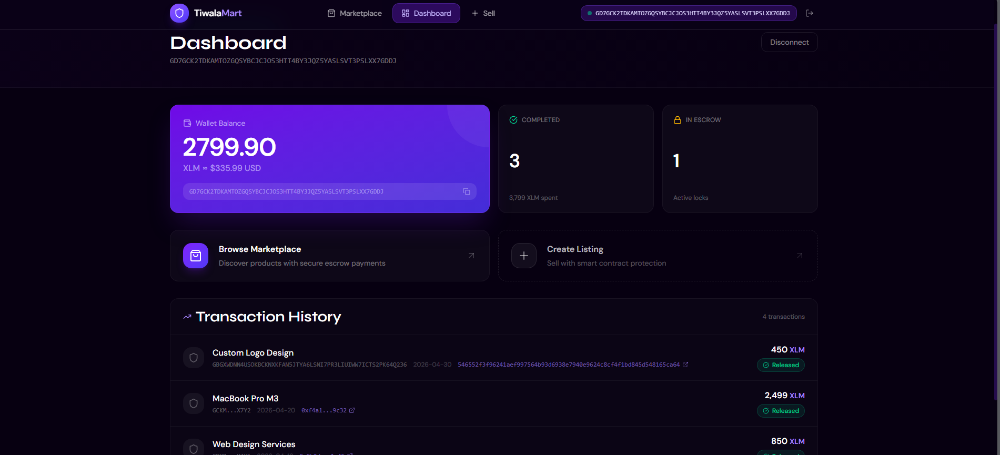

# TiwalaMart

> **Trustless escrow marketplace payments for Southeast Asia, powered by Stellar Soroban - funds are securely locked on-chain and only released when the buyer confirms delivery. No intermediaries. No manual overrides. Pure conditional settlement.**

*"Tiwala"* means **trust** in Filipino - and that is exactly what this protocol delivers - for buyers to safely purchase goods knowing their funds are only released upon confirmed delivery.

---

## Problem

Online transactions in the Philippines and across Southeast Asia suffer from a fundamental lack of trust. Buyers routinely send payments upfront via e-wallets with no guarantee that goods will be delivered or services completed. The result is a cycle of scams, failed deliveries, unresolved disputes, and eroding confidence in digital commerce - especially in informal, peer-to-peer marketplaces.

## Solution

TiwalaMart is a **trustless escrow payment system** built on Stellar using Soroban smart contracts, with a full React frontend and Freighter wallet integration. Funds are locked on-chain the moment a buyer initiates a transaction. They are only released to the seller after the buyer confirms fulfillment - or refunded if the seller cannot deliver. Every state transition is enforced by contract logic and logged as an on-chain event.

---

## Stellar Features Used

| Feature | Role in TiwalaMart |
|---|---|
| **Soroban Smart Contracts** | Core escrow logic - locking, releasing, refunding, state tracking |
| **XLM Transfers** | Locked payments and automatic settlement via the token client |
| **Stellar Asset Contract (SAC)** | Native XLM used as the payment token via the wrapped SAC on testnet |
| **Event Logs** | Real-time payment status events: `locked`, `released`, `refunded` |
| **Freighter Wallet** | Browser wallet for signing and submitting Soroban transactions |
| **Soroban RPC** | Direct JSON-RPC calls for simulation, submission, and tx polling |
| **Horizon API** | Account sequence number and balance queries |

---

## How It Works

```
Buyer  ──► create_escrow(buyer, seller, token, amount)
                │  funds transferred: buyer → contract
                │  EscrowState stored on-chain (status = Locked)
                │  "locked" event emitted
                ▼
           [goods/services delivered]
                │
Buyer  ──► confirm_delivery(tx_id, buyer)
                │  funds transferred: contract → seller
                │  status = Released
                │  "released" event emitted
                ▼
           [OR - if something goes wrong]
                │
Buyer/Seller ► refund_buyer(tx_id, caller)
                │  funds transferred: contract → buyer
                │  status = Refunded
                │  "refunded" event emitted
```

---

## Smart Contract - Public Interface

### `create_escrow`
```rust
pub fn create_escrow(
    env: Env,
    buyer: Address,
    seller: Address,
    token: Address,
    amount: i128,
) -> u64   // returns the escrow transaction ID
```
Called by the buyer to lock funds into the contract. Transfers `amount` tokens from buyer → contract, stores the full `EscrowState` on-chain, emits a `locked` event, and returns the unique `tx_id`.

---

### `confirm_delivery`
```rust
pub fn confirm_delivery(env: Env, tx_id: u64, buyer: Address)
```
Called by the **original buyer** after receiving goods or confirming service completion. Transfers funds from contract → seller and sets status to `Released`.

Validations: caller must be the original buyer (`ERR_UNAUTHORIZED`); status must be `Locked` (`ERR_WRONG_STATUS`).

---

### `refund_buyer`
```rust
pub fn refund_buyer(env: Env, tx_id: u64, caller: Address)
```
Called by **either the buyer or seller** to cancel and return funds. Transfers funds from contract → buyer and sets status to `Refunded`.

Validations: caller must be buyer or seller (`ERR_UNAUTHORIZED`); status must be `Locked` (`ERR_WRONG_STATUS`).

---

### `get_escrow`
```rust
pub fn get_escrow(env: Env, tx_id: u64) -> EscrowState
```
Read-only view returning the full `EscrowState` for a given ID.

---

### `get_status`
```rust
pub fn get_status(env: Env, tx_id: u64) -> EscrowStatus
```
Lightweight read returning only the current status (`Locked` | `Released` | `Refunded`).

---

## Data Types

### `EscrowState`
```rust
pub struct EscrowState {
    pub buyer:  Address,      // wallet that locked the funds
    pub seller: Address,      // wallet that receives on release
    pub token:  Address,      // token contract (XLM SAC or custom)
    pub amount: i128,         // amount locked, in stroops
    pub status: EscrowStatus, // Locked | Released | Refunded
}
```

### `EscrowStatus`
```rust
pub enum EscrowStatus {
    Locked,    // funds held; awaiting buyer confirmation
    Released,  // buyer confirmed; funds sent to seller
    Refunded,  // cancelled; funds returned to buyer
}
```

### Error Codes
| Code | Constant | Meaning |
|---|---|---|
| `1` | `ERR_NOT_FOUND` | Escrow ID does not exist |
| `2` | `ERR_WRONG_STATUS` | Operation invalid for current status |
| `3` | `ERR_UNAUTHORIZED` | Caller is not the expected party |

---

## Storage Layout

| Key | Type | Description |
|---|---|---|
| `Escrow(tx_id)` | `EscrowState` | Full escrow record keyed by ID |
| `TxCounter` | `u64` | Auto-incrementing escrow ID counter |

---

## Frontend

The frontend is a React + Vite application with Tailwind CSS and shadcn/ui. It integrates directly with the deployed Soroban contract via the `@stellar/stellar-sdk` and the Freighter browser wallet.

### Pages

| Page | Description |
|---|---|
| **HomePage** | Landing page - hero, features, how it works |
| **WalletConnect** | Connect Freighter wallet; displays address and XLM balance |
| **Marketplace** | Browse and buy listings from other sellers |
| **CreateListing** | Create a new product or service listing |
| **EscrowTransaction** | Full escrow flow - pay, track status, confirm delivery or request refund |
| **Dashboard** | View your listings and purchase history |

### Soroban Integration (`src/utils/soroban.ts`)

All contract interactions go through `soroban.ts`, which handles:

- **Account fetching** via Horizon REST API for sequence numbers
- **Transaction building** with `@stellar/stellar-sdk` `TransactionBuilder`
- **Simulation** via direct Soroban RPC `simulateTransaction` - applies resource fees and `SorobanData` from sim result
- **Auth injection** - sim-returned auth entries are injected into the raw XDR envelope when present; implicit source-account auth is preserved when sim returns none (critical for `confirm_delivery` across different accounts)
- **Signing** via Freighter's `signTransaction`
- **Submission** via Soroban RPC `sendTransaction`
- **Polling** with `getTransaction` until `SUCCESS` or `FAILED`
- **Return value parsing** - parses the `u64` escrow ID from `resultMetaXdr` after `create_escrow` so each purchase gets its correct on-chain ID

---

## Project Structure

```
tiwalamart/
├── contract/
│   ├── lib.rs              # Soroban smart contract (escrow logic + events)
│   └── test.rs             # Unit tests
├── Cargo.toml              # Rust manifest, Wasm release profile
│
└── frontend/               # React + Vite app
    ├── src/
    │   ├── app/
    │   │   ├── components/
    │   │   │   ├── pages/
    │   │   │   │   ├── HomePage.tsx
    │   │   │   │   ├── WalletConnect.tsx
    │   │   │   │   ├── Marketplace.tsx
    │   │   │   │   ├── CreateListing.tsx
    │   │   │   │   ├── EscrowTransaction.tsx
    │   │   │   │   └── Dashboard.tsx
    │   │   │   ├── shared/
    │   │   │   │   └── Navbar.tsx
    │   │   │   └── ui/               # shadcn/ui components
    │   │   ├── context/
    │   │   │   └── WalletContext.tsx  # Freighter wallet state
    │   │   └── routes.tsx
    │   ├── utils/
    │   │   ├── soroban.ts            # Soroban RPC + contract integration
    │   │   └── wallet.ts             # Freighter helpers
    │   └── main.tsx
    ├── .env                          # Contract ID, RPC URL, network config
    ├── vite.config.ts
    └── package.json
```

---

## Prerequisites

### Contract
- **Rust** `1.74+` with `wasm32-unknown-unknown` target:
  ```bash
  rustup target add wasm32-unknown-unknown
  ```
- **Stellar CLI** `v22.x`:
  ```bash
  cargo install --locked soroban-cli --features opt
  ```

### Frontend
- **Node.js** `18+`
- **pnpm** (recommended):
  ```bash
  npm install -g pnpm
  ```
- **Freighter Wallet** browser extension - [freighter.app](https://freighter.app)

---

## Build the Contract

```bash
cd tiwalamart
soroban contract build

# Output:
# target/wasm32-unknown-unknown/release/tiwala_mart.wasm
```

---

## Test the Contract

```bash
cargo test

# Expected output:
# running 3 tests
# test tests::test_happy_path_create_confirm_release ... ok
# test tests::test_edge_case_double_release_rejected ... ok
# test tests::test_state_verification_storage_and_refund ... ok
#
# test result: ok. 3 passed; 0 failed
```

---

## Deploy to Testnet

```bash
soroban contract deploy \
  --wasm target/wasm32-unknown-unknown/release/tiwala_mart.wasm \
  --source alice \
  --network testnet

# Save the returned CONTRACT_ID - you need it in .env
```

---

## Run the Frontend

```bash
cd frontend

# Install dependencies
pnpm install

# Configure environment
cp .env.example .env
# Fill in:
#   VITE_CONTRACT_ID=<your deployed contract ID>
#   VITE_STELLAR_NETWORK=TESTNET
#   VITE_RPC_URL=https://soroban-testnet.stellar.org
#   VITE_HORIZON_URL=https://horizon-testnet.stellar.org
#   VITE_XLM_TOKEN=CDLZFC3SYJYDZT7K67VZ75HPJVIEUVNIXF47ZG2FB2RMQQVU2HHGCYSC

pnpm dev
# → http://localhost:5173
```

---

## Deployed Contract

| Network | Contract ID |
|---|---|
| Stellar Testnet | `CCICDAEHA2CVKLCG6YPD5EZFJ5JGPDNIGMFHU2TUFKCX5RMFTK4M7ESB` |

🔗 [View on Stellar Lab](https://lab.stellar.org/r/testnet/contract/CCICDAEHA2CVKLCG6YPD5EZFJ5JGPDNIGMFHU2TUFKCX5RMFTK4M7ESB)

---

## Sample CLI Invocations

Replace `<CONTRACT_ID>`, `<BUYER>`, `<SELLER>`, and `<TOKEN>` with real testnet values.

### Create Escrow (buyer locks funds)
```bash
soroban contract invoke \
  --id <CONTRACT_ID> \
  --source alice \
  --network testnet \
  -- create_escrow \
  --buyer GBUYERADDRESS \
  --seller GSELLERADDRESS \
  --token CDLZFC3SYJYDZT7K67VZ75HPJVIEUVNIXF47ZG2FB2RMQQVU2HHGCYSC \
  --amount 50000000

# Returns: tx_id (u64), e.g. 1
```

### Confirm Delivery (buyer releases funds to seller)
```bash
soroban contract invoke \
  --id <CONTRACT_ID> \
  --source alice \
  --network testnet \
  -- confirm_delivery \
  --tx_id 1 \
  --buyer GBUYERADDRESS
```

### Refund Buyer (either party cancels)
```bash
soroban contract invoke \
  --id <CONTRACT_ID> \
  --source alice \
  --network testnet \
  -- refund_buyer \
  --tx_id 1 \
  --caller GSELLERADDRESS
```

### Get Escrow State (read-only)
```bash
soroban contract invoke \
  --id <CONTRACT_ID> \
  --network testnet \
  -- get_escrow \
  --tx_id 1
```

### Get Status Only
```bash
soroban contract invoke \
  --id <CONTRACT_ID> \
  --network testnet \
  -- get_status \
  --tx_id 1

# Returns: "Locked" | "Released" | "Refunded"
```

---

## Test Coverage

| Category | Tests |
|---|---|
| Happy path | `create_escrow` → `confirm_delivery` → funds released to seller |
| Double-release guard | Second `confirm_delivery` on a Released escrow panics with `ERR_WRONG_STATUS` |
| State & refund | On-chain state verified after create; `refund_buyer` returns funds to buyer |

---

## Target Users

- Online buyers and sellers in online marketplaces (Carousell, Facebook Marketplace, etc.)
- Freelance service providers - design, dev, tutoring, delivery
- Small businesses transacting across PH, VN, ID
- Any two parties needing conditional settlement without a middleman

---

## Project Demo (Screenshots)
1. Wallet Connected State


2. Balance Displayed

   
3. Successful Testnet Transaction


4. Transaction result shown to the user


---

## Reference

- Stellar Bootcamp 2026: https://github.com/armlynobinguar/Stellar-Bootcamp-2026
- Community Treasury (reference implementation): https://github.com/armlynobinguar/community-treasury
- Soroban Docs: https://developers.stellar.org/docs/smart-contracts
- Freighter Wallet: https://freighter.app

---

## License

```
MIT License

Copyright (c) 2026 TiwalaMart

Permission is hereby granted, free of charge, to any person obtaining a copy
of this software and associated documentation files (the "Software"), to deal
in the Software without restriction, including without limitation the rights
to use, copy, modify, merge, publish, distribute, sublicense, and/or sell
copies of the Software, and to permit persons to whom the Software is
furnished to do so, subject to the following conditions:

The above copyright notice and this permission notice shall be included in
all copies or substantial portions of the Software.

THE SOFTWARE IS PROVIDED "AS IS", WITHOUT WARRANTY OF ANY KIND, EXPRESS OR
IMPLIED, INCLUDING BUT NOT LIMITED TO THE WARRANTIES OF MERCHANTABILITY,
FITNESS FOR A PARTICULAR PURPOSE AND NONINFRINGEMENT. IN NO EVENT SHALL THE
AUTHORS OR COPYRIGHT HOLDERS BE LIABLE FOR ANY CLAIM, DAMAGES OR OTHER
LIABILITY, WHETHER IN AN ACTION OF CONTRACT, TORT OR OTHERWISE, ARISING FROM,
OUT OF OR IN CONNECTION WITH THE SOFTWARE OR THE USE OR OTHER DEALINGS IN
THE SOFTWARE.
```
